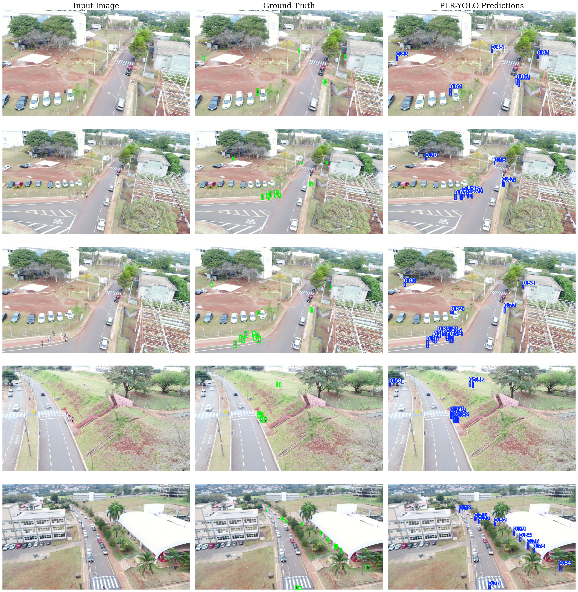

# Preserving Pixels, Expanding Context: A Structural Approach to Tiny Human Detection from UAVs

## Overview
**PLR-YOLO** is a lightweight object detection framework designed specifically for **tiny human detection in UAV imagery**. It addresses critical limitations in standard YOLO architectures when detecting extremely small objects (≈20×28 pixels) by:

- Preserving pixel-level spatial information at the input stage
- Expanding receptive fields efficiently without increasing computational cost

Built on a YOLOv11n baseline, PLR-YOLO achieves **higher accuracy with fewer parameters and lower FLOPs**, making it suitable for **real-time edge deployment**.

---

## Key Features

- **Pixel-Preserving Stem (PPStem)**  
  Eliminates information loss caused by stride-2 convolutions using Space-to-Depth transformation.

- **Lightweight Receptive Field Bottleneck (LRF-C3k2)**  
  Multi-branch depthwise-dilated convolutions (d = 1, 2, 3) for efficient multi-scale context aggregation.

- **Edge-Optimized**  
  Reduced parameters and FLOPs for deployment on UAV onboard systems.

- **Cross-Modality Performance**  
  Validated on both thermal (HIT-UAV) and RGB (Unicamp-UAV) datasets.

---

## Results

### Performance Comparison

| Model        | Dataset        | mAP@50 | Params (M) | GFLOPs |
|-------------|---------------|--------|--------|--------|
| YOLOv11n    | HIT-UAV       | $91.96\%$ | 2.60 | 6.50 |
| **PLR-YOLO**| HIT-UAV       | **+1.62 ↑** | **1.31** |**5.07** |
| YOLOv11n    | Unicamp-UAV   | $68.47\%$ | 2.60 | 6.50 |
| **PLR-YOLO**| Unicamp-UAV   | **+4.91 ↑** | **1.31** |**5.07** |

On **Unicamp-UAV**, PLR-YOLO surpasses all compared medium-scale YOLO models while requiring ~12× fewer parameters and ~12× fewer GFLOPs.

---

## Predictions on Unicamp-UAV

---

## Demonstration Notebook of PLR-YOLO

*Note: This notebook is provided for **preview purposes only**.*

---

## Installation

Coming soon.
